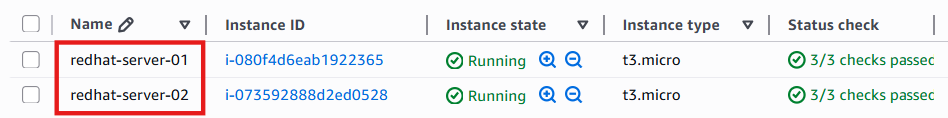
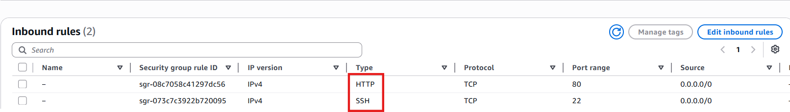
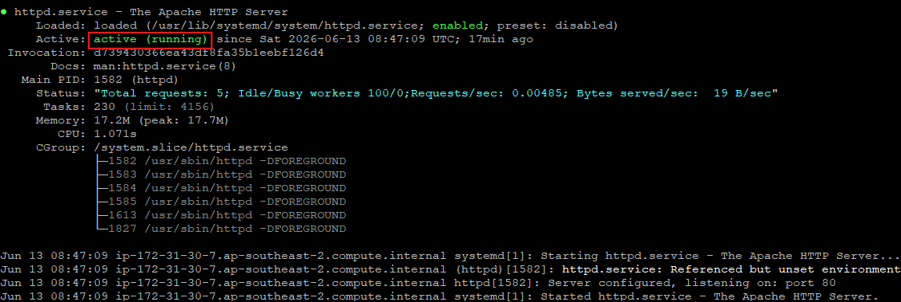
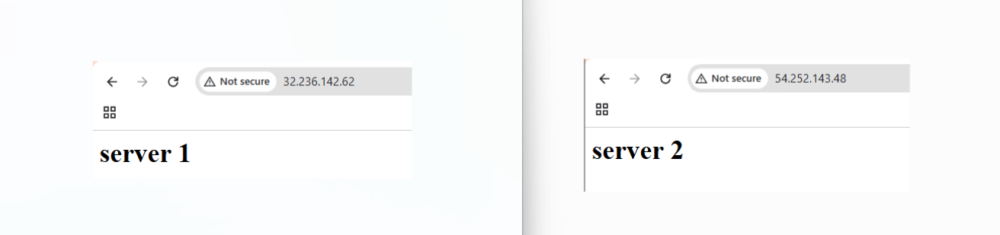
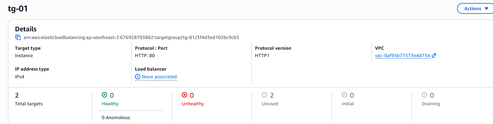
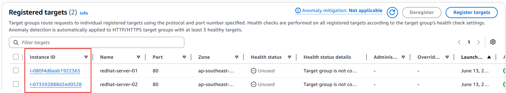
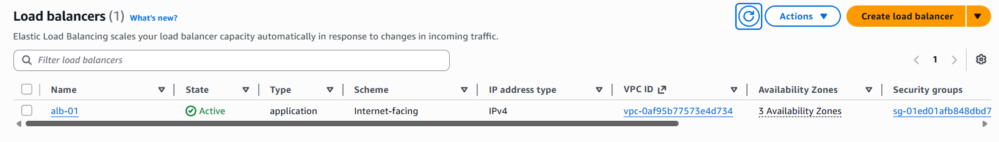
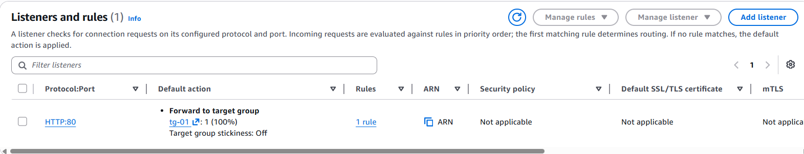
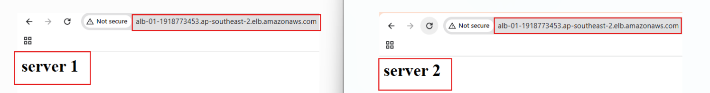

# AWS Application Load Balancer Project

## Objective

Distribute incoming traffic across multiple EC2 instances using AWS Application Load Balancer.

---

## Services Used

* AWS EC2
* AWS Application Load Balancer
* AWS Target Group
* AWS Security Group
* Red Hat Linux
* HTTPD Web Server

---

## Step 1 - Launch EC2 Instances

Launch multiple Red Hat EC2 instances.

---

## Step 2 - Configure Security Group

Allow HTTP and SSH traffic.

---

## Step 3 - Install HTTPD Web Server

Install and start HTTPD web server on both EC2 instances.

---

## Step 4 - Create Web Pages

Create custom web pages on both servers.

---

## Step 5 - Create Target Group

Create a target group for EC2 instances.

---

## Step 6 - Register Targets

Register EC2 instances to the target group.

---

## Step 7 - Create Application Load Balancer

Create an Application Load Balancer.

---

## Step 8 - Configure Listener

Configure HTTP listener and forward traffic to target group.

---

## Step 9 - Verify Load Balancing

Access Load Balancer DNS and verify traffic distribution across EC2 instances.

---

# Final Result

Successfully distributed traffic across multiple Red Hat EC2 instances using AWS Application Load Balancer.
